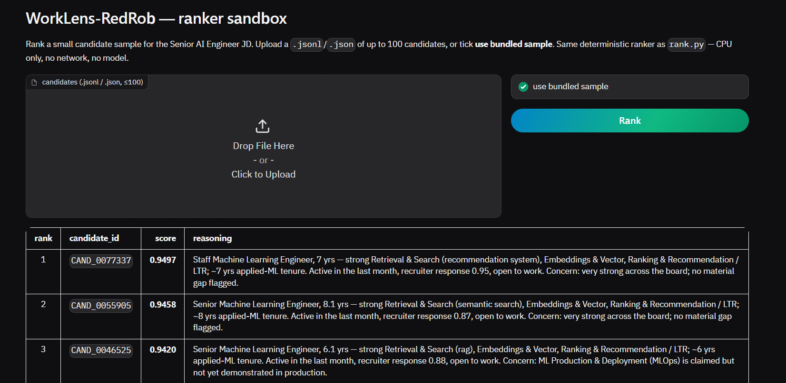

# WorkLens

**Deterministic Candidate Ranking Engine**

A deterministic candidate ranking engine that evaluates 100,000 candidate profiles against a structured job specification in under 2 minutes on a single CPU core. Designed for explainability, reproducibility, and configuration-driven evaluation with no runtime network dependencies.


[🚀 Live Demo](https://huggingface.co/spaces/nitheshkummar/redrob)



---

## ⚡ Engineering Highlights

- ✅ **Configuration-driven evaluation pipeline** — adapt to any role by editing JSON, zero code changes
- ✅ **O(N log K) streaming top-K ranking** — bounded min-heap, constant memory over any input size
- ✅ **Deterministic and explainable scoring** — same input → byte-identical output, every rank justified
- ✅ **CPU-only execution** — no GPU, no network, no pre-computation
- ✅ **Constant-memory processing** — streams 465 MB input without loading it into memory
- ✅ **Strong interface contracts with Pydantic schemas** — typed schemas at every module boundary, malformed data fails fast

---

## 📊 Performance

| | |
|---|---|
| 📦 **100K Candidates** | Processed in a single streaming pass |
| ⏱️ **< 2 min** | Wall time on a single CPU core |
| 💾 **O(K) Memory** | Only top-100 held in memory, not the full pool |
| 📐 **O(N log K)** | Heap insert per candidate — no full sort |
| 🔁 **Deterministic** | Byte-identical output across runs — no wall-clock dependency |
| 📦 **1 Dependency** | `pydantic` — stdlib `csv`, `json`, `heapq` handle the rest |

---

## 🏗️ System Architecture


An 8-stage streaming pipeline. Each candidate is scored through modules 2–5, inserted into the bounded top-K heap (module 6), and discarded — the full pool is never held in memory. Only the retained top-K receive reasoning (module 7) and validation (module 8) before output.

> [📖 Read the full architecture deep-dive →](docs/ARCHITECTURE.md)

---

## Quick Start

### Local

```bash
python -m venv .venv && .venv\Scripts\activate    # Linux/macOS: source .venv/bin/activate
pip install -r requirements.txt
python rank.py --candidates ./candidates.jsonl --out ./output.csv
```

### Docker

```bash
docker build -t worklens .
docker run --rm -v "$PWD:/data" worklens \
    --candidates /data/candidates.jsonl --out /data/output.csv
```

> `candidates.jsonl` isn't in the repo  — point `--candidates` at your copy
(a plain `.jsonl` or a gzipped `.jsonl.gz` both work).

---

## Repository Structure

```
rank.py              → Pipeline entrypoint
data/                → Capability ontology + job rubric (configuration)
shared/
  ├── config/        → All scoring constants, paths, runtime config
  ├── models/        → Pydantic schemas (interface contracts)
  └── utils/         → Phrase matching, JSONL streaming, date math
modules/             → 8 single-responsibility pipeline stages
tests/               → pytest suite (32 tests)
docs/                → Architecture, methodology, design rationale
```

---

## Testing

```bash
pytest -v    # 32 tests — scoring, ranking, honeypot, phrase matching, output validation
```

All tests use synthetic candidates built in-process — no dependency on the full dataset.
