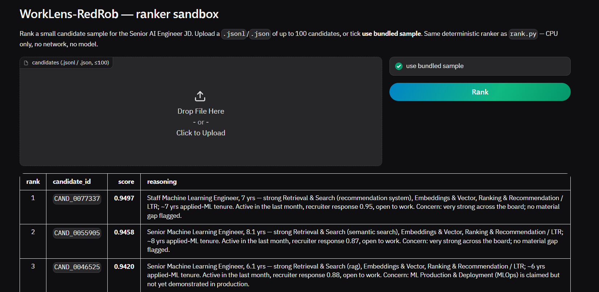

# WorkLens

**Deterministic candidate ranking engine**

WorkLens ranks 100,000 candidate profiles against a structured job specification and writes the top 100, each with a one-line explanation. It is rule-based and runs on a single CPU core in about 17-30 seconds, with no network access and no model downloads.

[Live demo](https://huggingface.co/spaces/nitheshkummar/redrob)



---

## Highlights

- **Configuration-driven.** The role is described by two JSON files and one constants module; adapting to another role does not require code changes. The recency reference date is detected from the input, and the id format and list size are settings.
- **Checked against the job description.** An independent review of the output grades all of the top 10 as strong matches (see [docs/RANKING_REVIEW.md](docs/RANKING_REVIEW.md)).
- **Streaming top-K.** A bounded min-heap keeps the best K candidates in one pass: O(N log K) time, with only K candidate records held in memory.
- **Deterministic and explainable.** The same input produces a byte-identical CSV, and every row has a reason built from the candidate's own data.
- **Typed stage boundaries.** Each stage exchanges Pydantic models; malformed input records are logged and skipped.
- **One runtime dependency.** `pydantic`; everything else is the Python standard library.

---

## Performance

Measured on the full 100K pool on a Windows laptop (Python 3.11, single core):

| | |
|---|---|
| Records | 100,000 in one streaming pass |
| Wall time | about 17-30 seconds at normal load (previously 45-50 s); up to 2× longer when the laptop is thermally throttled |
| Memory | K = 100 candidate records retained, plus the set of seen ids for validation |
| Selection | O(N log K) heap inserts, no full sort |
| Reproducibility | byte-identical output across runs |

### Speed-up

The run is about **2.8× faster** than the submitted version (CPU time, alternating runs on the same machine). Capability extraction (module2), which was 65% of the run time, went from about 40 s to about 5 s:

- Profiling showed 80% of the time in phrase matching.
- The pool's 300,171 career entries contain only 340 distinct role texts.
- module2 now matches each distinct text part once, caches the phrases it contains, and scores candidates by set lookups. The cache hit rate is 99.8%.
- A substring prefilter skips the word-boundary check for absent phrases.

See [docs/PERFORMANCE.md](docs/PERFORMANCE.md) for the measurements, the correctness argument and the rejected alternatives.

---

## System Architecture


An eight-stage pipeline. Each candidate is scored by modules 2-5, offered to the module 6 heap, and discarded. After the pass, only the retained 100 get reasoning (module 7) and the rows are validated before the CSV is written (module 8).

See [docs/ARCHITECTURE.md](docs/ARCHITECTURE.md) for the full design.

---

## Quick Start

### Local

```bash
python -m venv .venv
.venv\Scripts\activate            # Linux/macOS: source .venv/bin/activate
pip install -r requirements.txt
python rank.py --candidates ./candidates.jsonl --out ./output.csv
```

`candidates.jsonl` is not in the repository; point `--candidates` at your copy. Plain `.jsonl` and gzipped `.jsonl.gz` both work.

| Option | Default | Meaning |
|---|---|---|
| `--candidates` | required | candidate pool |
| `--out` | `outputs/submission.csv` | output CSV |
| `--top-k` | 100 | number of candidates to output |
| `--as-of` | latest `last_active_date` in the input | reference date for recency |
| `--ontology`, `--jd-rubric` | files in `data/` | role configuration |
| `--limit` | none | stop after N candidates (testing) |

Exit codes: `0` success, `1` the output failed validation (no CSV is written), `2` invalid arguments, configuration or output path.

### Docker

```bash
docker build -t worklens .
docker run --rm --user "$(id -u):$(id -g)" -v "$PWD:/data" worklens \
    --candidates /data/candidates.jsonl --out /data/output.csv
```

`--user` lets the container write the CSV into the mounted directory as your host user.

---

## Using other data or another role

- **Another role:** edit `data/ai_capability_ontology.json` (capability areas, phrases, weights) and `data/jd_rubric.json` (nice-to-have and ML-relevant areas, red-flag rules and wording, consulting firms, home country, cities, work modes). Numbers live in `shared/config/scoring.py`.
- **Another pool:** records must follow the candidate schema (`shared/models/candidate.py`). Set `CANDIDATE_ID_PATTERN` in `shared/config/run_config.py` if ids use another format. Records that fail validation are logged and skipped.

---

## Repository Structure

```
rank.py              Pipeline entry point
data/                Capability ontology and job rubric (configuration)
shared/
  config/            Scoring constants, paths, id format
  models/            Pydantic models exchanged between stages
  utils/             Phrase matching, JSONL streaming, text assembly, date math
modules/             The eight pipeline stages
tools/               Calibration sensitivity check, matcher benchmark
tests/               pytest suite
docs/                Architecture, methodology, scoring design, design decisions, performance, ranking review
```

---

## Testing

```bash
pip install -r requirements-dev.txt
pytest
```

34 test functions (94 cases) cover phrase matching and negation, every evidence tier, every anti-signal rule, behavioural scoring and availability rules, honeypot rules, top-K ranking, reasoning text, input reading, output validation, and end-to-end runs of `rank.py`. Repeated checks are table-driven (`pytest.mark.parametrize`). All tests build synthetic candidates in-process and do not need the candidate pool.
