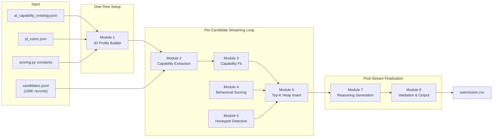
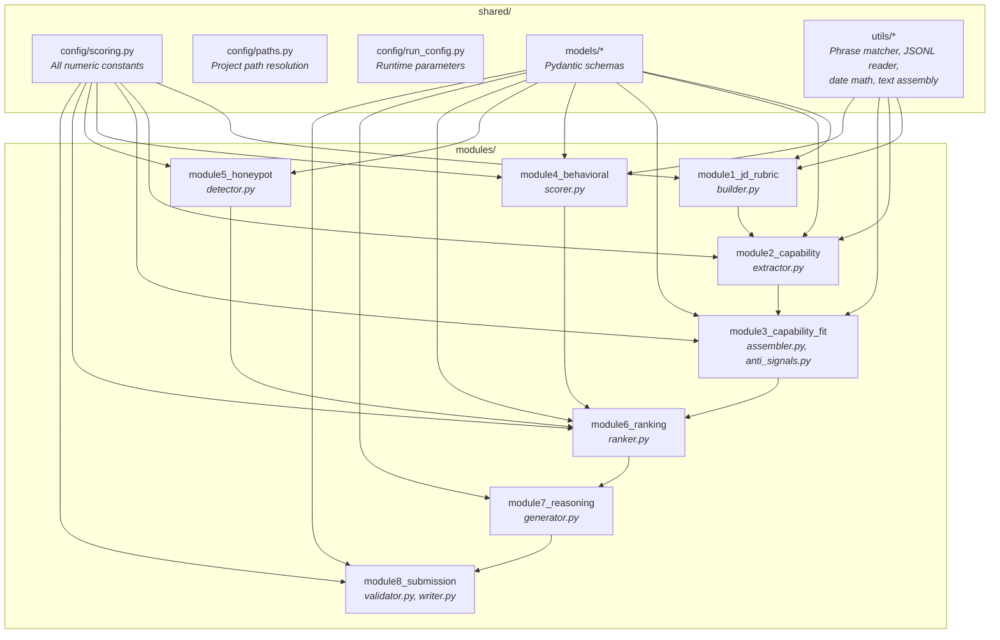

# Architecture

This document covers WorkLens's system design, data flow, module responsibilities, and the engineering rationale behind key decisions.

---

## System Overview

WorkLens is a **deterministic, streaming scoring pipeline** that ranks candidates against a structured job specification. It processes 100,000 records in a single pass with constant memory overhead.



**Key invariant:** Modules 2–6 run inside the streaming loop. Each candidate is scored, heap-inserted, and discarded — the full candidate pool is never held in memory. Only the top K (default 100) survive for reasoning and output.

---

## Module Dependency Graph



Each module depends **only downward** — there are no circular imports and no cross-module state.

---

## Scoring Pipeline Detail

### Stage 1 — JD Profile Construction (one-time)

Merges three sources into a single `JDProfile`:

| Source | Provides |
|--------|----------|
| `ai_capability_ontology.json` | 9 capability nodes with importance weights and phrase families |
| `jd_rubric.json` | Which nodes are nice-to-have, anti-signal keywords, consulting companies, target cities |
| `scoring.py` | Penalty values, experience bands, behavioral weights, thresholds |

**Design decision:** Separating *what to match* (JSON data) from *how much it matters* (Python constants) means adapting to a new role requires no code changes — only data file edits.

### Stage 2 — Capability Extraction

For each of the 9 ontology nodes, assigns a strength:

| Strength | Condition | Rationale |
|----------|-----------|-----------|
| **1.0** | Strong phrase found in career history (titles + descriptions) | Demonstrated work — highest confidence |
| **1.0** | Skill at advanced/expert with assessment score ≥ 50 | Platform-verified proficiency |
| **0.5** | Strong phrase found only in summary/headline/skills | Claimed but not demonstrated |
| **0.5** | Weak phrase found in career history | Ambiguous evidence in a credible context |
| **0.0** | No match, or weak phrase only in claimed text | No evidence or keyword-stuffing signature |

The importance-weighted mean of all node strengths produces `base_capability ∈ [0, 1]`.

**Design decision:** The demonstrated-vs-claimed split is the core anti-gaming mechanism. A candidate who describes building a recommendation system earns full credit; one who merely lists "RAG" as a skill earns half. This asymmetry is what prevents keyword-stuffed profiles from ranking highly.

### Stage 3 — Capability Fit Assembly

Adjusts `base_capability` through four modifiers:

```
capability_fit = clamp₀₁(effective_base × E × D − anti_penalty + nice_bonus)
```

| Modifier | Range | Purpose |
|----------|-------|---------|
| Experience factor (E) | 0.70 – 1.00 | Peaks at 5–9 years; penalizes under-experience |
| Domain depth factor (D) | 0.85 – 1.10 | Rewards ≥4 years of domain-relevant tenure |
| Anti-signal penalties | 0.00 – 0.50 | Subtracts for negative indicators (research-only, framework-tutorial, etc.) |
| Nice-to-have bonus | 0.00 – 0.10 | Small additive bonus for supplementary capability nodes |

**Design decision:** Anti-signals are *subtractive*, not *multiplicative*. A research-only penalty reduces the score but doesn't zero it — preserving rank differentiation among imperfect candidates.

### Stage 4 — Behavioral Multiplier

Converts 23 platform engagement signals into 8 weighted sub-scores:

```
behavioral_multiplier = 0.50 + 0.50 × Σ(wᵢ × sub_scoreᵢ)    ∈ [0.50, 1.00]
```

| Sub-score (weight) | Signals Used |
|--------------------|-------------|
| Recency (0.30) | `last_active_date` vs. fixed reference date |
| Responsiveness (0.25) | `recruiter_response_rate × time_factor` |
| Open to work (0.10) | `open_to_work_flag` |
| Interview (0.10) | `interview_completion_rate` |
| Offer (0.05) | `offer_acceptance_rate` |
| Logistics (0.10) | `notice_period_days`, location match, work mode |
| Demand (0.07) | `saved_by_recruiters_30d`, `search_appearance_30d` |
| Trust (0.03) | `verified_email`, `verified_phone`, `linkedin_connected` |

**Design decision:** The multiplier floor of 0.50 ensures behavior *rescales* capability but never overrides it. A strong but inactive candidate is halved, not dropped — the job spec says "down-weight the unavailable," not "exclude them."

**Design decision:** Recency is measured against a fixed date (the dataset's latest `last_active_date`), not `datetime.now()`. This guarantees deterministic output regardless of when the pipeline runs.

### Stage 5 — Honeypot Detection

Two rules detect provably-impossible profiles:

| Rule | Fires When | Interpretation |
|------|-----------|----------------|
| **H1** | ≥3 skills at advanced/expert with `duration_months == 0` | Claims expertise in skills they've never used |
| **H2** | Total career months > `years_of_experience × 12 × 1.5 + 12` | More career history than their stated working life allows |

Flagged candidates receive `final_score = 0.0` in Stage 6.

**Design decision:** Conservative thresholds (fires on ~0.04% of the pool) — designed to catch only genuinely impossible profiles, never borderline cases. A keyword-stuffer with a plausible timeline is handled by Stages 2–3, not here.

### Stage 6 — Streaming Top-K Selection

```python
final_score = 0.0 if honeypot else capability_fit × behavioral_multiplier
```

The top 100 candidates are maintained in a **bounded min-heap** of size K:

- **Insert:** Each scored candidate is pushed into the heap. If `len(heap) > K`, the smallest element is evicted.
- **Time complexity:** O(N log K) — one heap operation per candidate.
- **Memory:** O(K) — only 100 candidates are retained at any time.
- **Tie-breaking:** Score descending, then candidate ID ascending (enforced at both heap eviction and final sort).

**Design decision:** The heap carries each candidate's full scoring context (capability, fit, behavioral, honeypot objects) so that Module 7 can generate reasoning without re-reading the input file.

### Stage 7 — Reasoning Generation

Each of the top 100 receives a fact-grounded explanation built from a deterministic template:

```
"{title}, {years} yrs — {strengths}. {behavioral_note}. Concern: {concern}."
```

Every claim references the candidate's own fields or a matched evidence phrase — nothing is fabricated. The tone varies by rank: top candidates lead with strengths, lower-ranked ones lead with concerns.

### Stage 8 — Validation & Output

Before writing the CSV, a validator re-checks every rule:

- Exactly 100 rows, ranks 1–100 with no gaps or duplicates
- Scores are non-increasing by rank
- Equal scores have IDs in ascending order
- All candidate IDs match the `CAND_XXXXXXX` pattern and exist in the pool
- No empty reasoning strings
- Scores are not all identical (guards against degenerate output)

The pipeline **exits non-zero** if any check fails — an invalid CSV is never treated as success.

---

## Interface Contract

Every module boundary is defined by a Pydantic `BaseModel`. The complete schema chain:

```
Candidate (input)
    → CapabilityProfile (module 2 output)
    → CapabilityFit (module 3 output)
    → BehavioralProfile (module 4 output)
    → HoneypotAnalysis (module 5 output)
    → RankedEntry (module 6 output, internal dataclass)
    → SubmissionRow (module 8 output)
```

All models live in `shared/models/` — modules import schemas, never each other's internals. Field constraints (ranges, patterns, enums) are enforced by Pydantic at parse time, so invalid data fails at the boundary.

---

## Performance Characteristics

| Aspect | Design Choice | Impact |
|--------|--------------|--------|
| I/O | Single streaming pass over JSONL | Reads once, no random access |
| Memory | Bounded heap (K=100) | Constant regardless of input size |
| CPU | No regex in hot path (PhraseGroup uses string ops) | 6.7× faster than regex baseline |
| Determinism | Fixed reference date, stable sort, rounded scores | Byte-identical output across runs |
| Startup | Ontology + rubric loaded once, phrase groups compiled once | Amortized over 100K candidates |

---

## Reproducibility Guarantees

1. **No wall-clock dependency** — recency uses a fixed AS_OF date
2. **No randomness** — no random seeds, sampling, or stochastic algorithms
3. **No floating-point order sensitivity** — scores are rounded to 6 decimals before comparison
4. **No external state** — no database, cache, or network calls
5. **Stable sorting** — Python's `sorted()` is stable; tie-breaks use candidate ID (unique)
