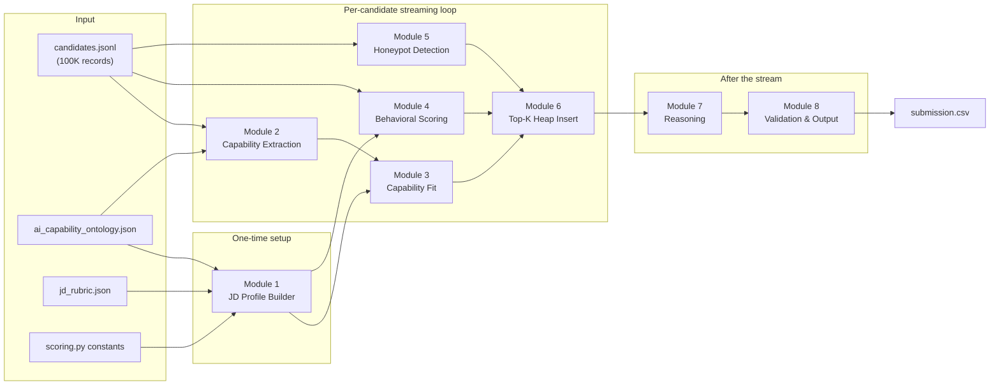
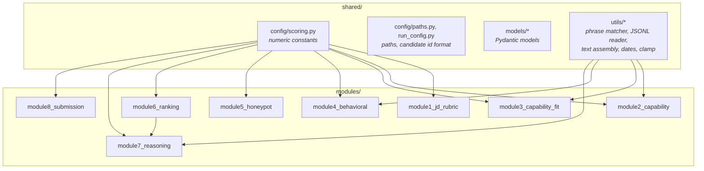

# Architecture

System design, data flow and module responsibilities for WorkLens.

---

## System Overview

WorkLens is a deterministic, streaming scoring pipeline that ranks candidates against a structured job specification. It processes the 100,000-record pool in a single pass and keeps only the top K candidate records in memory.


```mermaid
graph LR
    subgraph Input
        A["candidates.jsonl<br/>(100K records)"]
        B["ai_capability_ontology.json"]
        C["jd_rubric.json"]
        D["scoring.py constants"]
    end

    subgraph "One-time setup"
        E["Module 1<br/>JD Profile Builder"]
    end

    subgraph "Per-candidate streaming loop"
        F["Module 2<br/>Capability Extraction"]
        G["Module 3<br/>Capability Fit"]
        H["Module 4<br/>Behavioral Scoring"]
        I["Module 5<br/>Honeypot Detection"]
        J["Module 6<br/>Top-K Heap Insert"]
    end

    subgraph "After the stream"
        K["Module 7<br/>Reasoning"]
        L["Module 8<br/>Validation & Output"]
    end

    B --> E
    C --> E
    D --> E
    E --> G
    E --> H
    B --> F
    A --> F
    A --> H
    A --> I
    F --> G
    G --> J
    H --> J
    I --> J
    J --> K
    K --> L
    L --> M["submission.csv"]
```

Modules 2-6 run inside the streaming loop. Each candidate is scored, offered to the heap and discarded; only the top K (default 100) remain for reasoning and output. The reader also keeps the set of candidate ids it has seen, used to drop duplicates and to check that every output id exists in the pool. That set is the only state that grows with the input (a few MB for 100K ids).

---

## Module Dependencies


```mermaid
graph TD
    subgraph "shared/"
        SC["config/scoring.py<br/><i>numeric constants</i>"]
        SP["config/paths.py, run_config.py<br/><i>paths, candidate id format</i>"]
        M["models/*<br/><i>Pydantic models</i>"]
        U["utils/*<br/><i>phrase matcher, JSONL reader,<br/>text assembly, dates, clamp</i>"]
    end

    subgraph "modules/"
        M1["module1_jd_rubric"]
        M2["module2_capability"]
        M3["module3_capability_fit"]
        M4["module4_behavioral"]
        M5["module5_honeypot"]
        M6["module6_ranking"]
        M7["module7_reasoning"]
        M8["module8_submission"]
    end

    SC --> M1
    SC --> M2
    SC --> M3
    SC --> M4
    SC --> M5
    SC --> M6
    SC --> M7
    SC --> M8
    U --> M2
    U --> M3
    U --> M4
    U --> M7
    M6 --> M7
```

Every module imports models from `shared/models`. Between modules, the only import is module7 using module6's `RankedEntry`. There are no circular imports and no shared mutable state.

---

## Stage Detail

### Stage 1: JD profile (once per run)

Combines three sources into one `JDProfile`:

| Source | Provides |
|--------|----------|
| `ai_capability_ontology.json` | 9 capability nodes with importance weights and phrase lists |
| `jd_rubric.json` | nice-to-have and ML-relevant nodes, anti-signal vocabulary and reasoning wording, consulting firms, logistics (home country, cities, preferred work modes) |
| `scoring.py` | penalties, experience bands, thresholds and caps |

The builder lower-cases all vocabulary once and checks that every node named in the rubric exists in the ontology and every anti-signal has a penalty. A missing or inconsistent entry stops the run with exit code 2.

Keeping *what to match* (JSON) separate from *how much it counts* (Python constants) means adapting to another role is a data change, not a code change.

### Stage 2: Capability extraction

Each of the 9 nodes gets a strength:

| Strength | Source label | Condition |
|----------|--------------|-----------|
| 1.0 | `career` | strong phrase in career history (titles, descriptions) |
| 1.0 | `skill_verified` | advanced/expert skill matching any node phrase, assessment ≥ 50, and a weak phrase for the node in career history |
| 0.5 | `claimed` | strong phrase only in summary, headline or skills, or a verified skill with no career support |
| 0.5 | `career_weak` | only a weak (generic) phrase in career history |
| 0.0 | `none` | no evidence, or only a weak phrase in self-reported text |

`base_capability` is the importance-weighted mean of the strengths. `ml_relevant_months` sums the durations of roles matching any phrase of the rubric's `ml_nodes`, capped at the candidate's stated experience.

Phrase matching: a phrase must start at a word boundary ("search" does not match "research"). Phrases of four characters or fewer must also end at one ("rag" does not match "ragged"). A trailing `*` marks a stem. A match preceded within three words of the same clause by a negation or comparison cue (than, toward, not, no, never, without) is ignored, so "lighter weight than ranking systems" is not ranking evidence. Each text part (title, description, summary, skill name) is matched once by a cached `PhraseIndex`, and a candidate's evidence is the union of its parts' phrase sets.

### Stage 3: Capability fit

```
capability_fit = clamp01((effective_base × E × D − anti_penalty + nice_bonus) / 1.2)
```

1.2 is the largest value the numerator can reach (1.0 × 1.10 + 0.10), so the strongest profiles keep distinct scores instead of all clamping to 1.0.

| Term | Range | Purpose |
|------|-------|---------|
| Experience factor E | 0.70-1.00 | peaks at 5-9 years |
| ML-depth factor D | 0.85-1.10 | rewards years in ML-relevant roles |
| Anti-signal penalty | 0.00-0.50 | subtracts for patterns the job rejects |
| Nice-to-have bonus | 0.00-0.10 | small addition for supplementary nodes |

`effective_base` is capped at 0.30 when the hard-DQ anti-signal (`research_only`) fires. Penalties are subtractive, so an imperfect candidate is lowered rather than zeroed.

### Stage 4: Behavioral multiplier

```
behavioral_multiplier = 0.50 + 0.50 × Σ(wᵢ × sub_scoreᵢ)    in [0.50, 1.00]
                        0.50 if unavailable (inactive > 180 days or response rate < 0.10)
                        × 0.80 if outside the home country (no visa sponsorship)
```

| Sub-score (weight) | Signals |
|--------------------|---------|
| Recency (0.30) | days since `last_active_date`, measured from the reference date |
| Responsiveness (0.25) | `recruiter_response_rate`, `avg_response_time_hours` |
| Open to work (0.10) | `open_to_work_flag` |
| Interview (0.10) | `interview_completion_rate` |
| Offer (0.05) | `offer_acceptance_rate` (−1 = no history, scored 0.5) |
| Logistics (0.10) | `notice_period_days`, location/country/`willing_to_relocate`, `preferred_work_mode` |
| Demand (0.07) | `saved_by_recruiters_30d`, `search_appearance_30d` |
| Trust (0.03) | `verified_email`, `verified_phone`, `linkedin_connected` |

These use 14 of the 23 signals. The reference date is the latest `last_active_date` in the input (override with `--as-of`), so output does not depend on when the pipeline runs.

### Stage 5: Honeypot detection

| Rule | Fires when |
|------|-----------|
| H1 | ≥ 3 skills at advanced/expert with `duration_months == 0` |
| H2 | total career months > `years_of_experience × 12 × 1.5 + 12` |

On the 100K pool these flag 43 candidates (21 H1, 22 H2), whose final score is set to 0. The thresholds are conservative so that only genuinely impossible profiles are flagged.

### Stage 6: Streaming top-K

```python
final = 0.0 if honeypot else round(capability_fit * behavioral_multiplier, 6)
```

- Each candidate is offered to a min-heap of size K (default 100, `--top-k`): O(N log K).
- Heap elements are `(final, reversed candidate_id, ...)`, so on equal scores the larger id is evicted first, for any id format.
- The score is rounded before insertion, so eviction and final ordering compare the value written to the CSV.
- The retained entries are sorted by score descending, then candidate id ascending.

The heap carries each candidate's scoring objects, so module 7 needs no second pass over the input.

### Stage 7: Reasoning

Each retained candidate gets a template-built line:

```
first half:  "{title}, {years} yrs — {strengths}. {activity}. Concern: {gap}."
second half: "{title}, {years} yrs — main gap: {gap}. {strengths}; {activity}."
no gap:      "{title}, {years} yrs — {strengths}. {activity}. No material gap identified."
```

The gap is the first that applies, in this order:
1. a fired anti-signal
2. a critical node with no evidence
3. inactivity over 90 days or a recruiter response rate below 0.30
4. a notice period of 90 days or more
5. a critical node with only partial evidence
6. a missing nice-to-have node
7. under four years of ML tenure

Thresholds are the `REASON_*` constants in `scoring.py`; anti-signal wording comes from the rubric. Partial evidence is described by its source: "only self-reported" for `claimed`, "only indirect … evidence in career history" with the matched phrase for `career_weak`.

### Stage 8: Validation and output

Before writing, the validator checks:

- exactly K rows, ranks 1..K with no gaps or duplicates
- scores non-increasing by rank, with equal scores in ascending id order
- ids match `CANDIDATE_ID_PATTERN`, are unique and exist in the input pool
- no empty reasoning
- scores are not all identical

Any failure exits with code 1 and no CSV is written. The writer formats scores to six decimals and prefixes an apostrophe to any reasoning that starts with `=`, `+`, `-` or `@`, so spreadsheets do not evaluate it as a formula.

---

## Data Contracts

```
Candidate (input, validated per line)
    → CapabilityProfile   (module 2)
    → CapabilityFit       (module 3)
    → BehavioralProfile   (module 4)
    → HoneypotAnalysis    (module 5)
    → RankedEntry         (module 6, dataclass)
    → SubmissionRow       (module 8)
```

All models live in `shared/models/`. `JDProfile` carries the rubric to modules 3, 4 and 7, including the typed anti-signal vocabulary, reasoning wording and logistics settings. Input records that fail validation are logged and skipped, as are duplicate ids.

---

## Error Handling

| Situation | Behaviour |
|-----------|-----------|
| Malformed JSON line or schema violation | logged, counted, skipped |
| Duplicate candidate id | logged, counted, skipped (first occurrence kept) |
| Missing input file, bad `--as-of`, non-positive `--limit` or `--top-k` | usage error, exit code 2 |
| No `last_active_date` in the input and no `--as-of` | logged, exit code 2 |
| Ontology or rubric missing a key or inconsistent | logged, exit code 2 |
| Fewer than K valid candidates, or any output rule broken | errors logged, exit code 1, no CSV |
| Output path not writable | logged, exit code 2 |

---

## Performance

| Aspect | Choice | Effect |
|--------|--------|--------|
| I/O | single streaming pass over JSONL (or gzip) | input read once |
| Memory | heap of K = 100 records, plus the id set | no full pool in memory |
| CPU | each distinct text part matched once and cached (`PhraseIndex`); substring prefilter before boundary checks | module2 40 s → about 5 s; full run about 2.8× faster; see PERFORMANCE.md |
| Determinism | reference date from the input (not the clock), rounded scores, id tie-break | byte-identical output across runs |
| Setup | ontology, rubric and phrase groups built once | amortised over 100K candidates |
